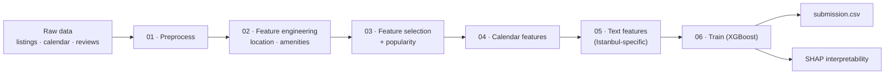
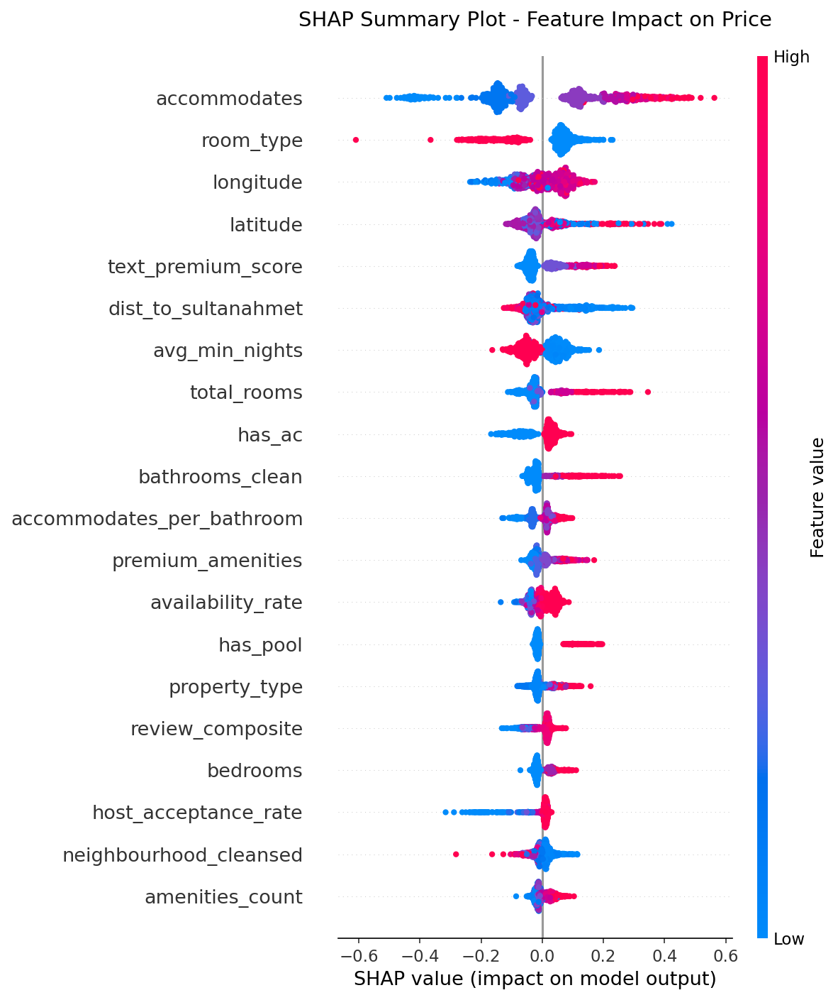
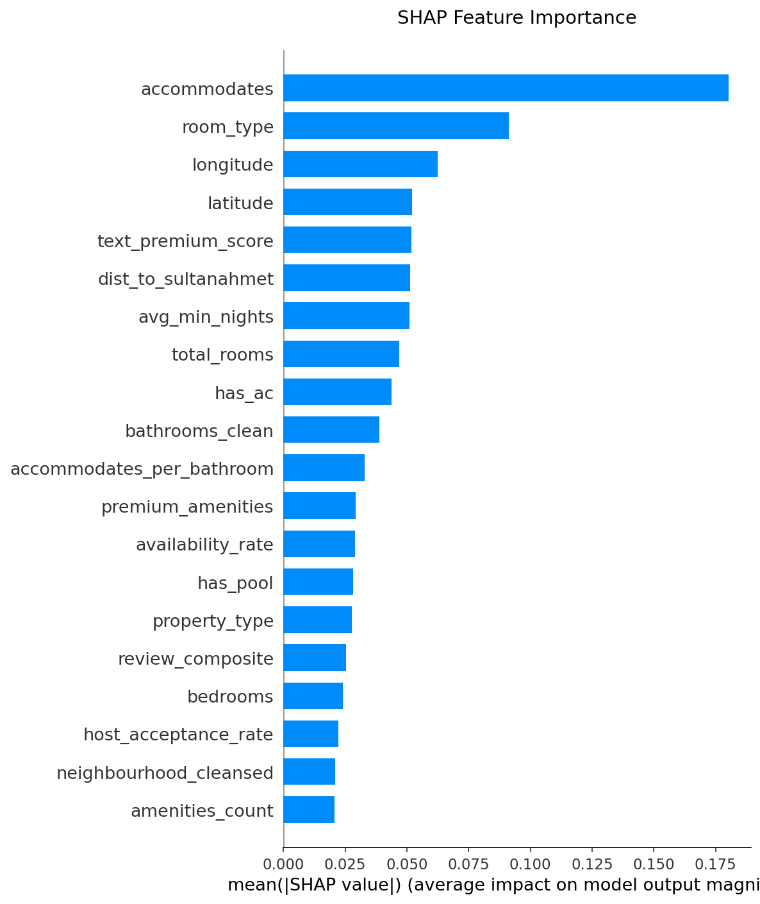

# Airbnb Istanbul Price Prediction

**Predict the nightly price of an Airbnb listing in Istanbul from its listing, calendar, review, and free-text data — a gradient-boosted model with Istanbul-specific feature engineering and SHAP interpretability, reaching 0.495 log-RMSE on the Kaggle private leaderboard.**

> YZV311 — Data Mining, Kaggle term-project competition · Team EnAi · Istanbul Technical University
> Muhammed Abdullah Özdemir · Nurettin Macit · Muhammed Hasan Bilal Cebeci

## Results

| Model | CV log-RMSE | Kaggle Private | Kaggle Public |
|-------|:-----------:|:--------------:|:-------------:|
| Ridge Regression | 0.523 | — | — |
| Random Forest | 0.446 | — | — |
| **XGBoost** | **0.422** | **0.495** | **0.507** |

## Pipeline



## Feature engineering

The edge in this project is domain-specific features for the Istanbul market, layered on top of the standard listing fields:

- **Location** — `dist_to_sultanahmet`, `dist_to_taksim` (km), `is_european_side` (European vs. Asian side of the Bosphorus).
- **Amenities** — binary flags (`has_pool`, `has_parking`, `has_elevator`, `has_gym`, …), a weighted `premium_amenities` score, and a `basic_amenities` count.
- **Text** (from the free-text description) — `has_bosphorus`, `has_sea` (view mentions), `has_terrace`, `has_rooftop`, and a combined `text_premium_score`.
- **Calendar** — `availability_rate`, `booking_rate`, `nights_flexibility`.
- **Popularity** — `total_reviews`, normalized `popularity_score`.

## Model

Final model — **XGBoost Regressor** (log-price target):

```python
xgb_params = {
    "n_estimators": 1200, "max_depth": 6, "learning_rate": 0.015,
    "min_child_weight": 4, "subsample": 0.8, "colsample_bytree": 0.75,
    "reg_alpha": 0.3, "reg_lambda": 1.5,
}
```

## Interpretability (SHAP)

SHAP attributes each prediction back to its features. The top drivers of price:

| # | Feature | Mean \|SHAP\| |
|--:|---|--:|
| 1 | accommodates | 18.0% |
| 2 | room_type | 9.1% |
| 3 | longitude | 6.2% |
| 4 | latitude | 5.2% |
| 5 | text_premium_score | 5.2% |
| 6 | dist_to_sultanahmet | 5.1% |
| 7 | avg_min_nights | 5.1% |
| 8 | total_rooms | 4.7% |
| 9 | has_ac | 4.4% |
| 10 | bathrooms_clean | 3.9% |

Capacity dominates, but engineered signals — `text_premium_score` and `dist_to_sultanahmet` — land in the top 6, confirming the location/text features carry real predictive weight.

| SHAP summary | Feature importance |
|---|---|
|  |  |

## Setup

```bash
git clone https://github.com/muhammedabdullahozdemirr/Airbnb_Istanbul_Price_Prediction.git
cd Airbnb_Istanbul_Price_Prediction
python -m venv .venv
source .venv/bin/activate        # Windows: .venv\Scripts\activate
pip install -r requirements.txt
```

The competition CSVs (`train.csv`, `test.csv`, `calendar.csv`, `reviews.csv`) are not redistributed here — place them under `data/raw/`.

## Running the pipeline

```bash
python notebooks/01_preprocess.py
python notebooks/02_feature_engineering.py
python notebooks/03_feature_selection.py
python notebooks/04_calendar_features.py
python notebooks/05_text_features.py
python notebooks/06_train.py            # writes data/processed/submission.csv
```

Optional:

```bash
python notebooks/00_eda.py              # exploratory data analysis
python notebooks/07_model_comparison.py # Ridge / Random Forest / XGBoost
jupyter notebook notebooks/shap_analysis.ipynb
```

## Project structure

```
.
├── notebooks/
│   ├── 00_eda.py … 07_model_comparison.py   # ordered pipeline (scripts)
│   └── shap_analysis.ipynb                  # SHAP interpretability
├── data/
│   ├── raw/                                 # competition CSVs (not committed)
│   └── processed/                           # generated features + submission
├── reports/                                 # EDA + SHAP figures
├── outputs/                                 # model outputs
├── requirements.txt
└── README.md
```

## Generative AI disclosure

Per course policy: ChatGPT and Claude were used for code refactoring, debugging assistance, and README drafting. All modeling decisions, feature design, and analysis are the team's own.
